# InternLM2实战营第二期-笔记

## 第二节课 《浦语大模型Demo》

1.在InternStudio算力平台创建一个10%A100开发机

根据文档链接的步骤安装conda环境即可

官方指导文档：[轻松玩转书生·浦语大模型趣味 Demo_github](https://github.com/InternLM/Tutorial/blob/camp2/helloworld/hello_world.md)

官方指导视频：[轻松玩转书生·浦语大模型趣味 Demo_bilibili](https://www.bilibili.com/video/BV1AH4y1H78d/)

以下全部模型下载的地址（Huggingface，ModelScop，OpenXLab）：[InternLM](https://github.com/InternLM/InternLM)


### 视频笔记+图文操作流程：

首先我们了解这一节课的主要内容和知识点

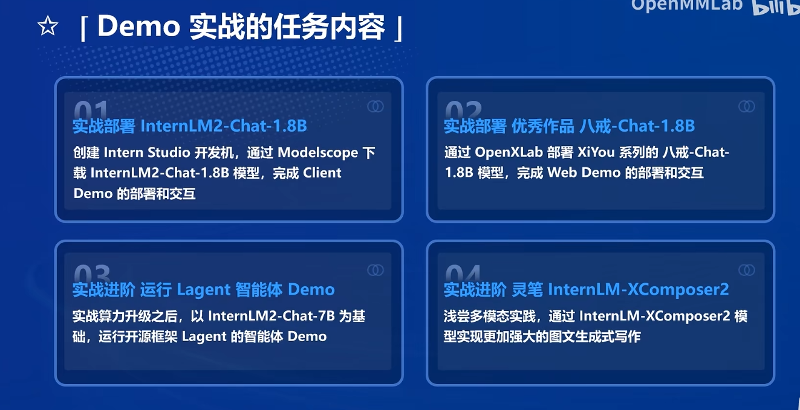

简单介绍书生浦语大模型SIG：


```python
studio-conda -o internlm-base -t demo
# 与 studio-conda 等效的配置方案
# conda create -n demo python==3.10 -y
# conda activate demo
# conda install pytorch==2.0.1 torchvision==0.15.2 torchaudio==2.0.2 pytorch-cuda=11.7 -c pytorch -c nvidia
```
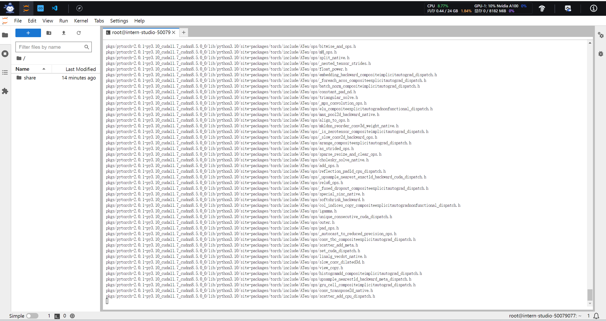

这一步骤等待时间较长，建议可以看看指导文档后面的内容，确保接下来的操作不会出现失误。

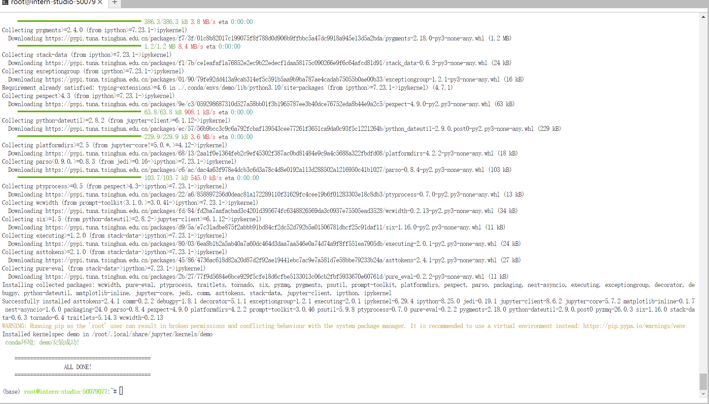

1.1**然后就是激活环境**

```python
conda activate demo
```

1.2**安装相关依赖包**

```
pip install huggingface-hub==0.17.3
pip install transformers==4.34 
pip install psutil==5.9.8
pip install accelerate==0.24.1
pip install streamlit==1.32.2 
pip install matplotlib==3.8.3 
pip install modelscope==1.9.5
pip install sentencepiece==0.1.99
```

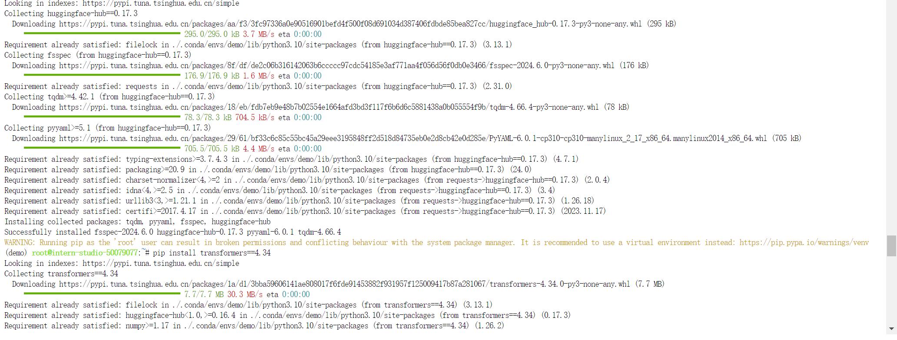

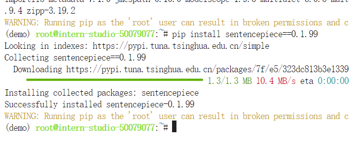

**2.下载InternLM2-Chat-1.8B模型**

```
mkdir -p /root/demo
touch /root/demo/cli_demo.py
touch /root/demo/download_mini.py
cd /root/demo
```

上述步骤分步执行或者一键执行都可。记得执行命令按（Enter）回车键。

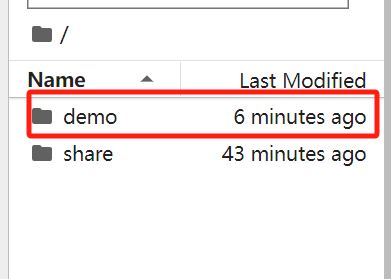

这里你在JupyterLab客户端点击左侧文件夹，可以看到demo目录，然后双击进入目录。

我们可以继续双击`/root/demo/download_mini.py` 文件，将下面代码粘贴进去，

```python
import os
from modelscope.hub.snapshot_download import snapshot_download

# 创建保存模型目录
os.system("mkdir /root/models")

# save_dir是模型保存到本地的目录
save_dir="/root/models"

snapshot_download("Shanghai_AI_Laboratory/internlm2-chat-1_8b", 
                  cache_dir=save_dir, 
                  revision='v1.1.0')

```

也可以直接采用echo命令的方式写入文件

```python
echo '
import os
from modelscope.hub.snapshot_download import snapshot_download
# 创建保存模型目录
os.system("mkdir /root/models")
# save_dir是模型保存到本地的目录
save_dir="/root/models"
snapshot_download("Shanghai_AI_Laboratory/internlm2-chat-1_8b", 
                  cache_dir=save_dir, 
                  revision="v1.1.0")
' > /root/demo/download_mini.py
# 运行脚本
python /root/demo/download_mini.py
```

这个代码的目的就是下载模型文件到本地指定目录，这里下载的是InternLM2-Chat-1.8B模型，执行后会有一个下载模型的进度展示。

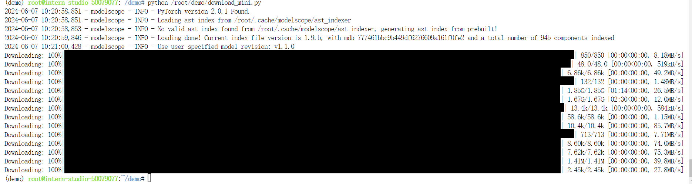


然后和上面一样双击打开 `/root/demo/cli_demo.py` 文件，也可直接采用echo命令写入cli_demo.py文件中。

```python
import torch
from transformers import AutoTokenizer, AutoModelForCausalLM


model_name_or_path = "/root/models/Shanghai_AI_Laboratory/internlm2-chat-1_8b"

tokenizer = AutoTokenizer.from_pretrained(model_name_or_path, trust_remote_code=True, device_map='cuda:0')
model = AutoModelForCausalLM.from_pretrained(model_name_or_path, trust_remote_code=True, torch_dtype=torch.bfloat16, device_map='cuda:0')
model = model.eval()

system_prompt = """You are an AI assistant whose name is InternLM (书生·浦语).
- InternLM (书生·浦语) is a conversational language model that is developed by Shanghai AI Laboratory (上海人工智能实验室). It is designed to be helpful, honest, and harmless.
- InternLM (书生·浦语) can understand and communicate fluently in the language chosen by the user such as English and 中文.
"""

messages = [(system_prompt, '')]

print("=============Welcome to InternLM chatbot, type 'exit' to exit.=============")

while True:
    input_text = input("\nUser  >>> ")
    input_text = input_text.replace(' ', '')
    if input_text == "exit":
        break

    length = 0
    for response, _ in model.stream_chat(tokenizer, input_text, messages):
        if response is not None:
            print(response[length:], flush=True, end="")
            length = len(response)

```
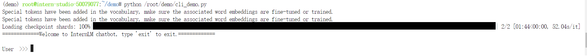

这段代码就是加载模型，然后推理结果的功能，里面创建了一个简单基于命令行形式的User-robot会话，用户可直接交互输入文本问题，模型输出响应，用户输入“exit”可结束对话，主要是用来验证InternLM2-Chat-1.8B模型的效果的。感觉响应还算可以。

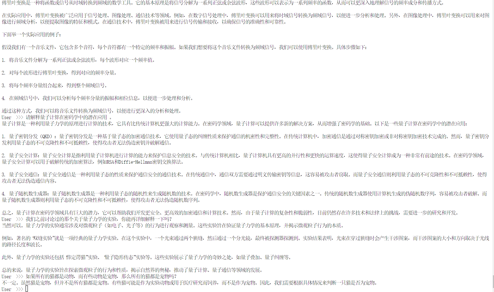

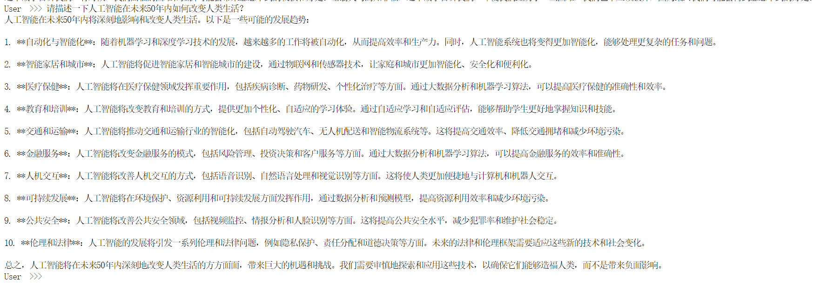

**变现不佳的情况**：仔细分析InternLM2-Chat-1.8B模型的“**请解释量子计算在密码学的潜在应用**”，会发现模型在输出**1.量子密钥分发（QKD）**的描述和**量子安全通信**的回答具有较高的相似性，回答并不够准确，并且在上一个问题，输出的实际应用例子的描述也过于简单。

接下来就是部署实战营优秀作品**`八戒-Chat-1.8B` 模型**


实战营一期的同学们微调出优秀的项目的模型地址如下：

- **八戒-Chat-1.8B：[八戒-Chat-1.8B](https://www.modelscope.cn/models/JimmyMa99/BaJie-Chat-mini/summary)**
- **Chat-嬛嬛-1.8B：[Chat-嬛嬛-1.8B](https://openxlab.org.cn/models/detail/BYCJS/huanhuan-chat-internlm2-1_8b)**
- **Mini-Horo-巧耳：[Mini-Horo-巧耳](https://openxlab.org.cn/models/detail/SaaRaaS/Horowag_Mini)**

这些模型都是基于InternLM2-Chat-1.8B进行微调训练的结果，主要展现了用较低的训练成本实现了不错的模型角色模仿能力，模型会根据不同的角色模仿角色说话方式，八戒-chat-1.8B训练数据是根据西游记剧本中所有关于猪八戒的台词和语句以及利用LLM API生成的数据结果。

先配置环境，然后获取仓库的Demo文件：

```python
conda activate demo

cd /root/
git clone https://gitee.com/InternLM/Tutorial -b camp2
# git clone https://github.com/InternLM/Tutorial -b camp2
cd /root/Tutorial
```
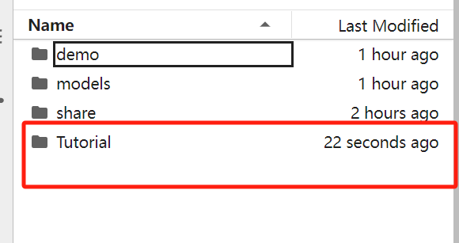
执行后，在JupyterLab客户端点击左侧文件夹，然后进到“Tutorial”文件夹。


下载运行chat-八戒Demo

```python
python /root/Tutorial/helloworld/bajie_download.py
```
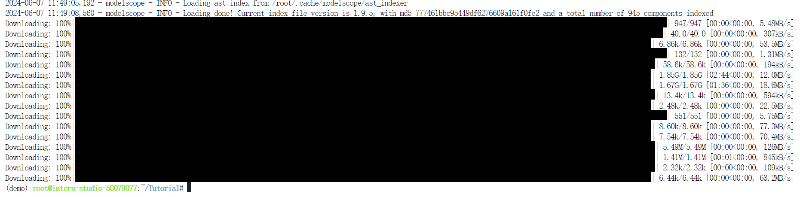

等上面命令将模型下载后，然后执行以下命令，其实就是用Streamlit框架将python编码快速转成web 应用开发，设置好服务地址和端口号。

```python
streamlit run /root/Tutorial/helloworld/bajie_chat.py --server.address 127.0.0.1 --server.port 6006
```
然后就是本地端口配置了，WIN+R进入，然后cmd，输入下面命令

```python
# 从本地使用 ssh 连接 studio 端口
# 将下方端口号 34656 替换成自己的端口号
ssh -CNg -L 6006:127.0.0.1:6006 root@ssh.intern-ai.org.cn -p 34656
```


然后输入开发机提供的ssh密码

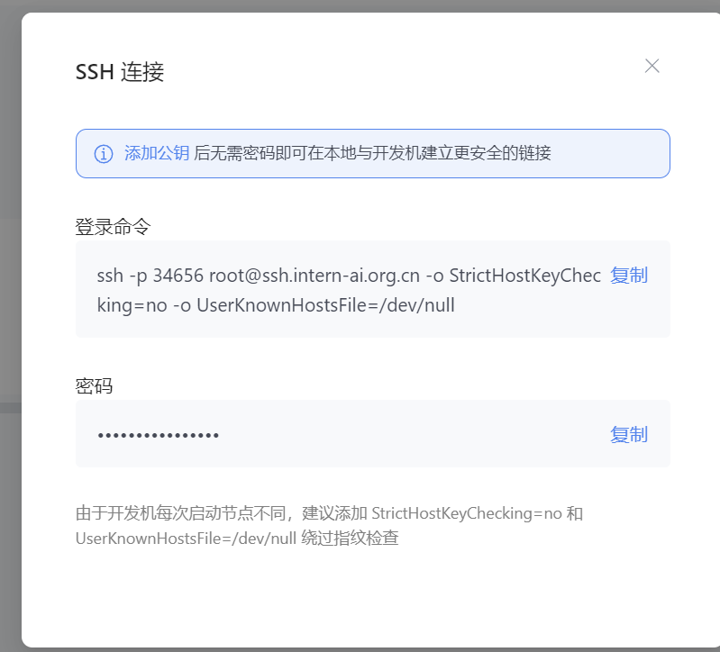

本地浏览器打开 [http://127.0.0.1:6006](http://127.0.0.1:6006/) 后，等待加载完成即可进行对话，输入内容示例如下：

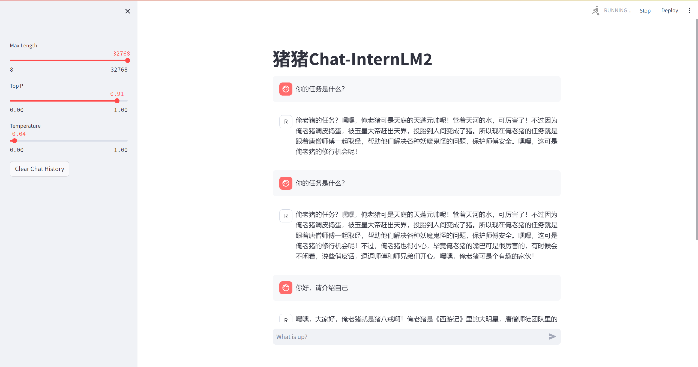

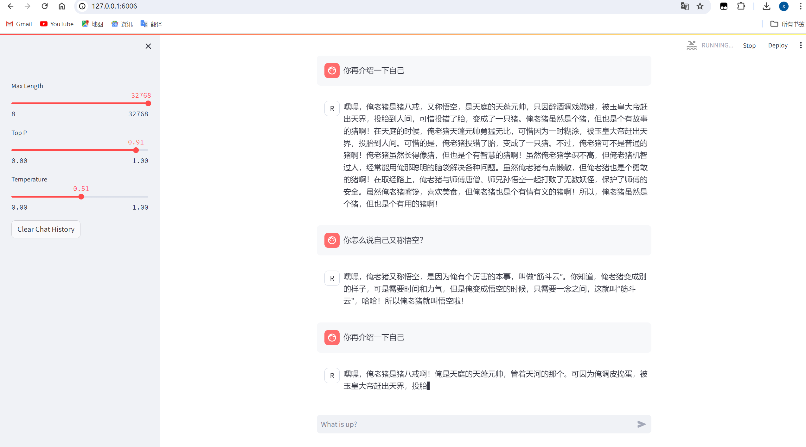


我发现在候选词较高，而温度参数较低也就是模型生成多样性很低的情况下，应该输出近乎训练数据集的效果，我发现出现了一点回答混乱的效果。还有个简单的小问题，就是本地浏览器打开访问web的时候，参数设置如果非空建议加上提示，而不是直接报错，提供学员更好的交互体验。

下面是控制生成文本参数简单介绍

>### 1.`max_length` 参数的设置

>`max_length`参数用来控制生成文本的长度。具体如下：

>- **短文本生成**：如果你希望生成简短的文本，如回答简短的问题或生成简短的句子，可以设置较低的 `max_length` 值。
>- **长文本生成**：如果你希望生成较长的文本，如文章、故事或详细的解释，可以设置较高的 `max_length` 值。

>### 2.`top-k` 参数

>`top-k` 参数用于限制模型在每一步生成词时只考虑概率最高的 k个词。具体如下：

>- **高 `top-k` 值**：模型在每一步生成时会考虑更多的可能词。这增加了生成文本的多样性，但也可能导致生成的文本质量下降，因为低概率的词也可能被选中。
>- **低 `top-k` 值**：模型在每一步生成时只考虑概率最高的少数几个词。这通常会使生成的文本更保守和连贯，但可能缺乏多样性。

>### 3.`temperature` 参数

>`temperature` 参数用于调整模型生成词的概率分布的平滑度。具体如下：

>- **高 `temperature` 值（>1）**：平滑概率分布，使得概率差异变小，增加了生成文本的随机性和多样性。
>- **低 `temperature` 值（<1）**：使概率分布更加尖锐，增强了高概率词的选择权重，生成的文本更确定、更连贯，但多样性降低。
>- **`temperature` 值接近 0**：使得模型几乎总是选择最高概率的词，生成的文本非常确定和连贯，但几乎没有多样性。


接下来就是实战**使用 `Lagent` 运行 `InternLM2-Chat-7B` 模型（需要开启 30% A100 权限后才可开启此章节）**

首先我先简单介绍下**Lagent**，Lagent 是一个轻量级、开源的基于大语言模型的智能体（agent）框架，支持用户快速地将一个大语言模型转变为多种类型的智能体，并提供了一些典型工具为大语言模型赋能。

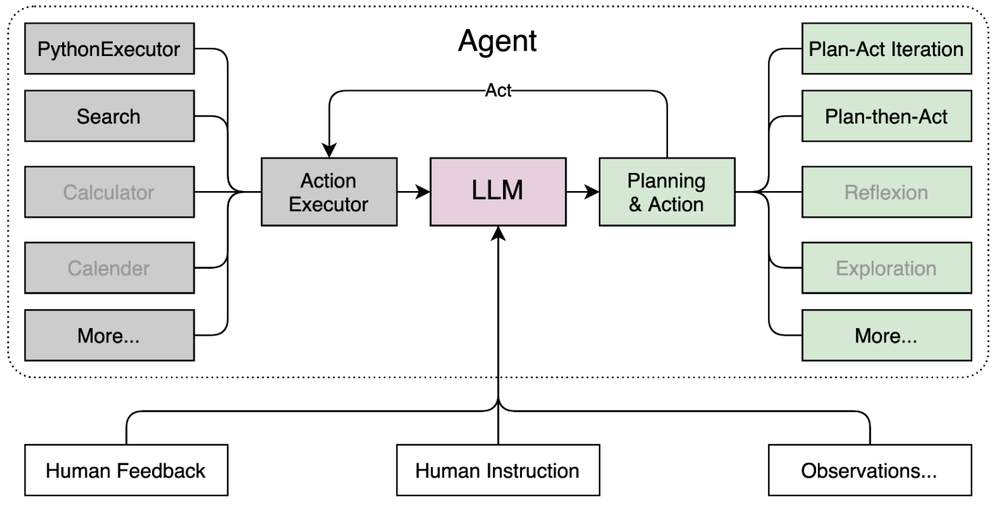

Lagent 的特性总结如下：

- 流式输出：提供 stream_chat 接口作流式输出，本地就能演示流式输出的 Demo。
- 接口统一，设计全面升级，提升拓展性，包括：
  - Model : 不论是 OpenAI API, Transformers 还是推理加速框架 LMDeploy 一网打尽，模型切换可以自由操作；
  - Action: 简单的继承和装饰，即可打造自己个人的工具集，不论 InternLM 还是 GPT 均可适配；
  - Agent：与 Model 的输入接口保持一致，模型到智能体的蜕变只需一步，便捷各种 agent 的探索实现；
- 文档全面升级，API 文档全覆盖。

废话不多话，开始实战，先将开发机升级（需要先停止开发机，才能升降配置）

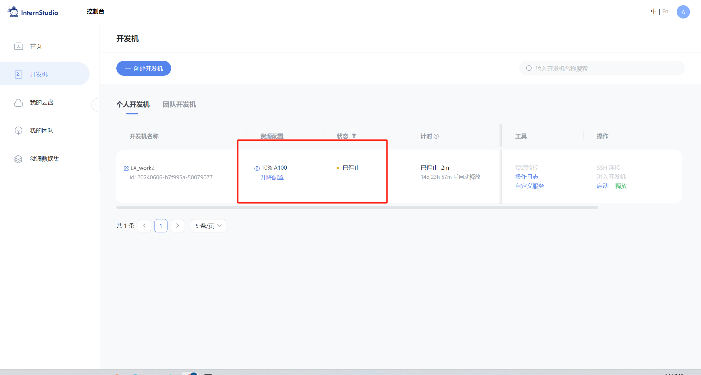

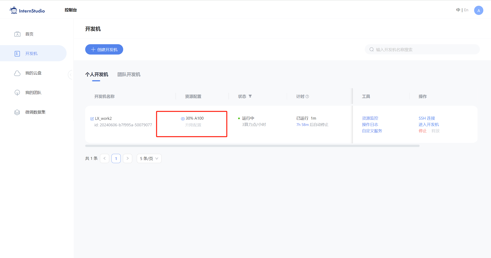

1.激活conda创建的虚拟环境demo

```python
conda activate demo
```
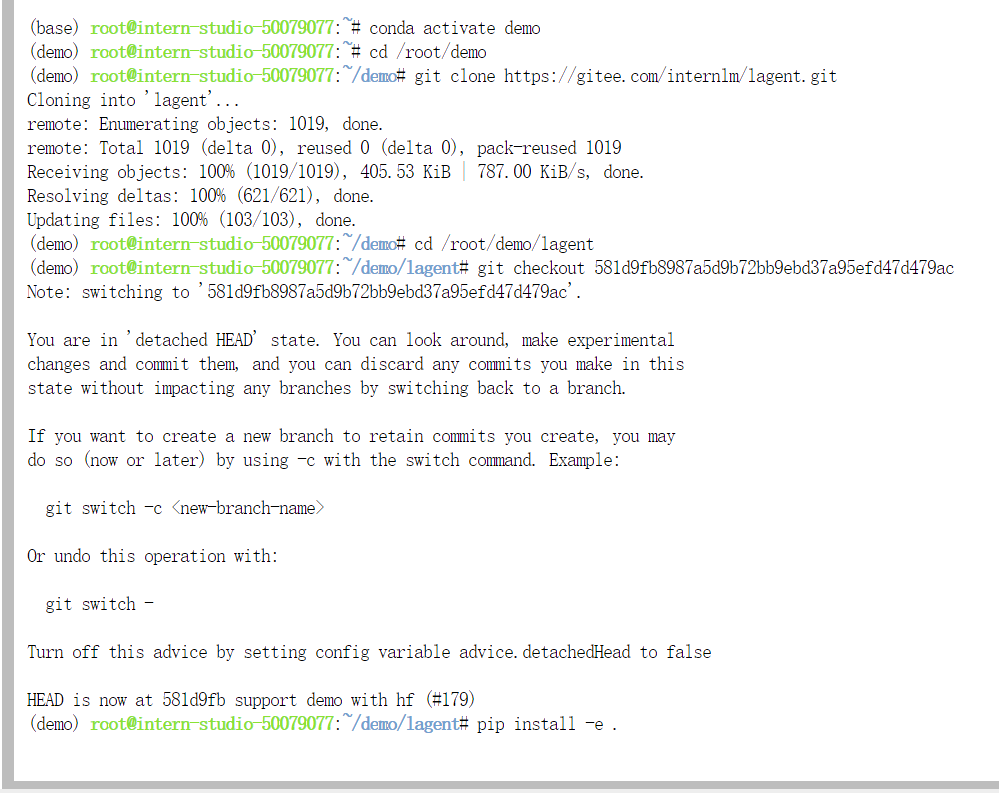


2.进入到demo路径中

```python
cd /root/demo
```

3.然后使用git命令下载Lagent智能体的代码库，然后cd到路径下，切换到指定的提交分支，安装当前目录需要的python包。

```python
git clone https://gitee.com/internlm/lagent.git
# git clone https://github.com/internlm/lagent.git
cd /root/demo/lagent
git checkout 581d9fb8987a5d9b72bb9ebd37a95efd47d479ac
pip install -e . # 源码安装
```
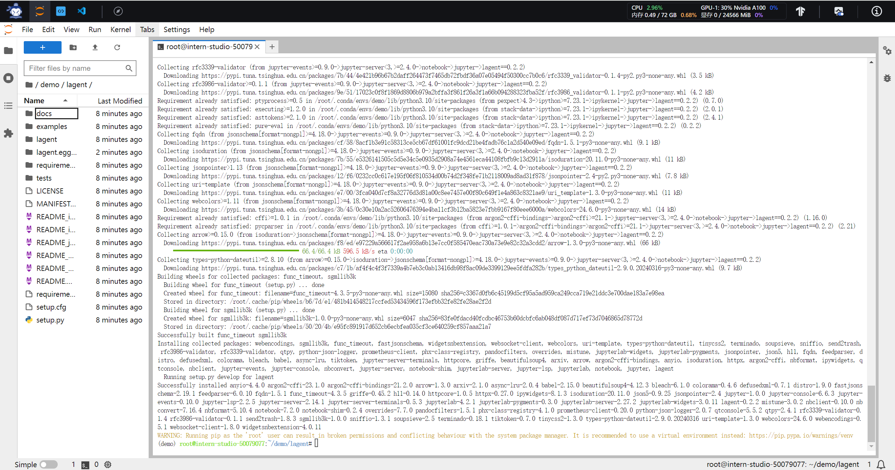

然后构建软链接快捷访问方式

```
ln -s /root/share/new_models/Shanghai_AI_Laboratory/internlm2-chat-7b /root/models/internlm2-chat-7b
```

打开 `lagent` 路径下 `examples/internlm2_agent_web_demo_hf.py` 文件，并修改对应位置 (71行左右) 代码（tips：这里修改路径注意点，我就不小心删除掉了一个小括号，后面需要kill掉6006端口，开发机啥也没有emmm，**这里放张图**），就是修改模型路径这一行：

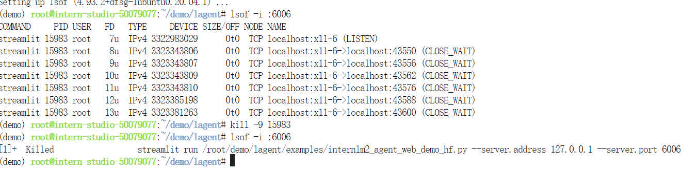

```python
# 其他代码...
value='/root/models/internlm2-chat-7b'
# 其他代码...
```

然后和上面八戒demo一样操作：

```python
streamlit run /root/demo/lagent/examples/internlm2_agent_web_demo_hf.py --server.address 127.0.0.1 --server.port 6006
```

这时候，直接本地配置ssh连接，还是win+R进入cmd，然后查看开发机端口号，

执行：

```
ssh -CNg -L 6006:127.0.0.1:6006 root@ssh.intern-ai.org.cn -p 34656
```
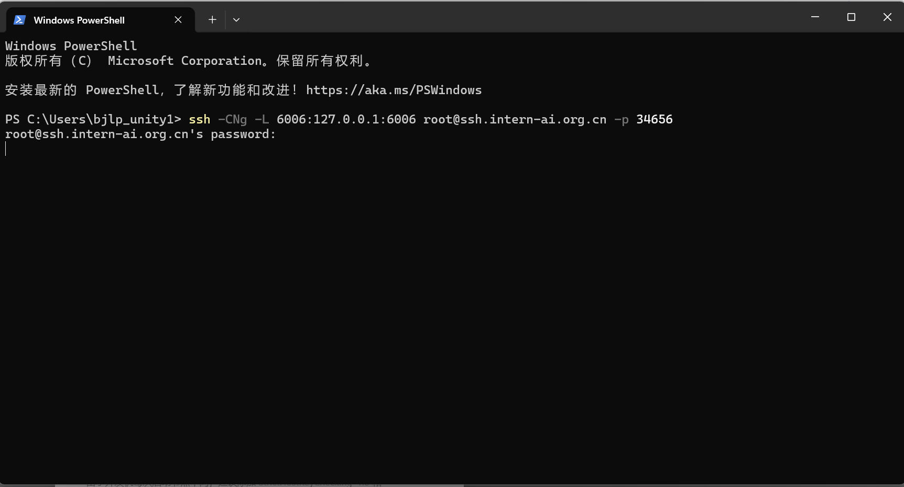

然后复制开发机ssh下面密码，直接ctrl+v即可


然后本地浏览器打开127.0.0.1:6006，显示如下：

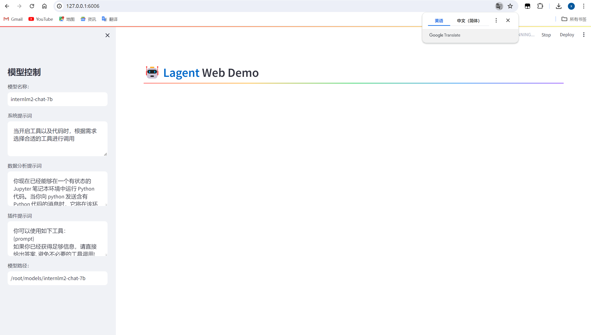

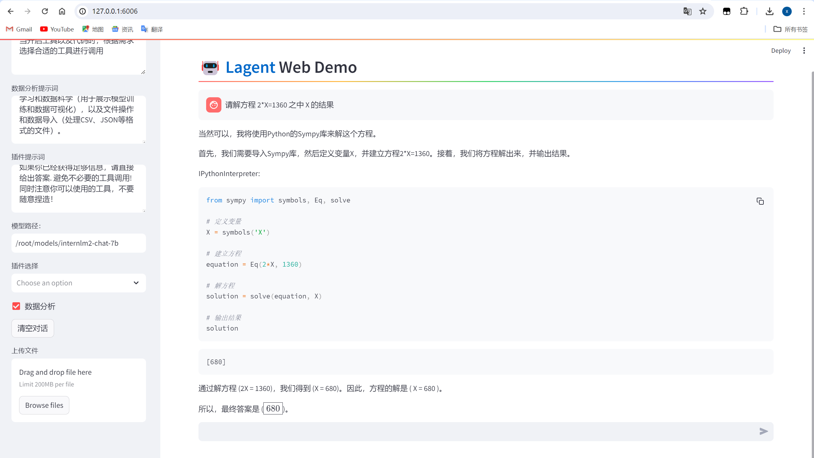

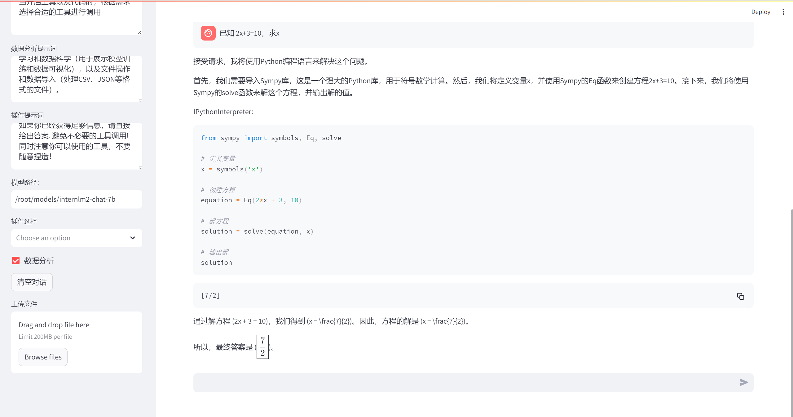

其实我们发现模型在解答数学知识的时候，模型是通过预定义的提示词，调用外部工具，并且定义智能体如何交互来实现输出的。


接下来就是 **实战：实践部署 `浦语·灵笔2` 模型（开启 50% A100 权限后才可开启此章节）**

和之前一样，先简单**介绍 `XComposer2` 相关知识**

`浦语·灵笔2` 是基于 `书生·浦语2` 大语言模型研发的突破性的图文多模态大模型，具有非凡的图文写作和图像理解能力，在多种应用场景表现出色，总结起来具有：

- 自由指令输入的图文写作能力： `浦语·灵笔2` 可以理解自由形式的图文指令输入，包括大纲、文章细节要求、参考图片等，为用户打造图文并貌的专属文章。生成的文章文采斐然，图文相得益彰，提供沉浸式的阅读体验。
- 准确的图文问题解答能力：`浦语·灵笔2` 具有海量图文知识，可以准确的回复各种图文问答难题，在识别、感知、细节描述、视觉推理等能力上表现惊人。
- 杰出的综合能力： `浦语·灵笔2-7B` 基于 `书生·浦语2-7B` 模型，在13项多模态评测中大幅领先同量级多模态模型，在其中6项评测中超过 `GPT-4V` 和 `Gemini Pro`。

然后还是根据先前步骤一样，需要先升级配置到50%才可以继续后面步骤。

接下来我就会快速操作，不会再详细描述和截图

激活demo虚拟环境，安装python相关依赖包。

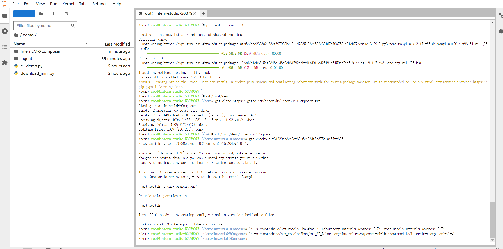

```python
conda activate demo
# 补充环境包
pip install timm==0.4.12 sentencepiece==0.1.99 markdown2==2.4.10 xlsxwriter==3.1.2 gradio==4.13.0 modelscope==1.9.5
# 下载 InternLM-XComposer 仓库 相关的代码资源
cd /root/demo
git clone https://gitee.com/internlm/InternLM-XComposer.git
# git clone https://github.com/internlm/InternLM-XComposer.git
cd /root/demo/InternLM-XComposer
git checkout f31220eddca2cf6246ee2ddf8e375a40457ff626
```

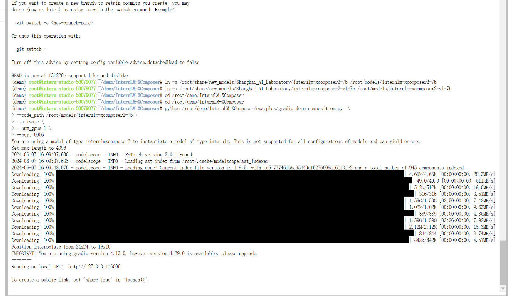

在 `terminal` 中输入指令，构造软链接快捷访问方式：

```python
ln -s /root/share/new_models/Shanghai_AI_Laboratory/internlm-xcomposer2-7b /root/models/internlm-xcomposer2-7b
ln -s /root/share/new_models/Shanghai_AI_Laboratory/internlm-xcomposer2-vl-7b /root/models/internlm-xcomposer2-vl-7b
```

然后就是输入命令，用于启动InternLM-XComposer：

```python
cd /root/demo/InternLM-XComposer
python /root/demo/InternLM-XComposer/examples/gradio_demo_composition.py  \
--code_path /root/models/internlm-xcomposer2-7b \
--private \
--num_gpus 1 \
--port 6006
```

然后还是和先前一样，本地启动PowerShell，本地执行

```
ssh -CNg -L 6006:127.0.0.1:6006 root@ssh.intern-ai.org.cn -p 34656
```

然后浏览器打开打开 [http://127.0.0.1:6006](http://127.0.0.1:6006/) 实践效果如下图所示：


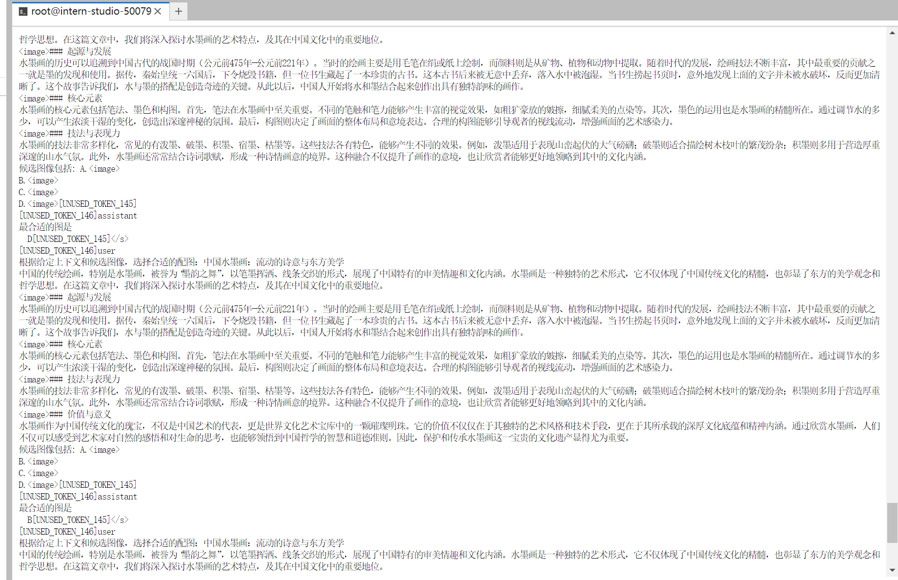


总的来说，效果还是很惊艳的，图文效果每一节都符合标题和素材，希望灵笔后续可以直接根据主题和素材，来文生图，图生图。可是很吃算力，并且生图的速度也会受影响，我寻思这能不能结合目前比较优秀的sd生图模型，加入到智能体去实现这个小小的demo，当然最终还是希望灵笔越来越智能。

接下来就是关闭前面的terminal终端，重新开启一个，展示图片识别理解的demo实现。

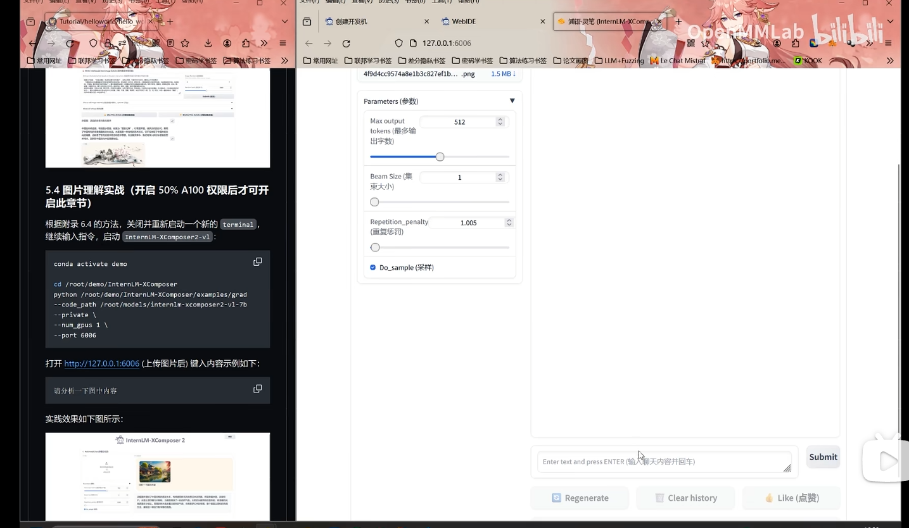

```python
conda activate demo

cd /root/demo/InternLM-XComposer
python /root/demo/InternLM-XComposer/examples/gradio_demo_chat.py  \
--code_path /root/models/internlm-xcomposer2-vl-7b \
--private \
--num_gpus 1 \
--port 6006
```

本地浏览器打开127.0.0.1:6006即可看到效果（不要忘记了本地CMD执行ssh连接的指令）

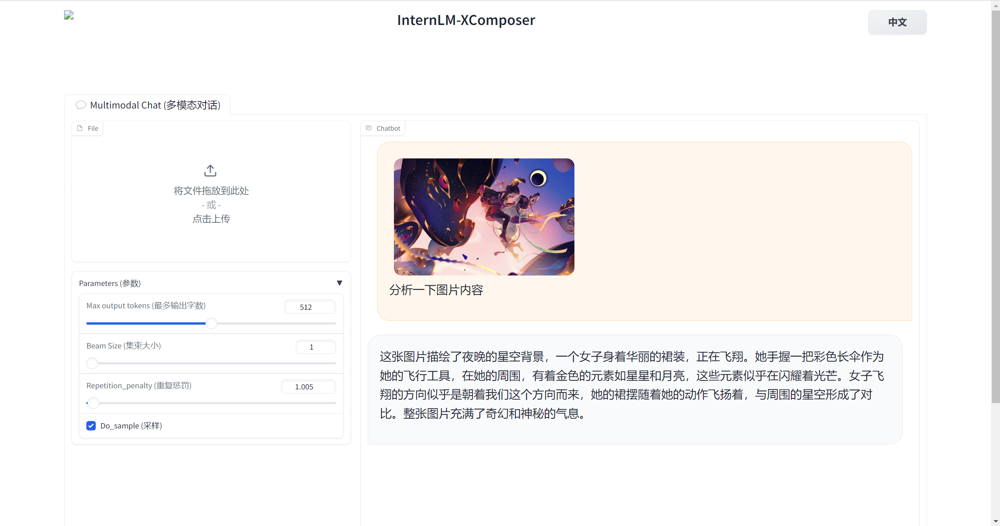

我发现单卡资源消耗有点高，如今还是多模态的数据的算力需求大，而短文本类的助手相比而言没有那么吃资源。InternLM-XComposer采用的是使用预训练的图像识别模型（如ResNet、ViT）来提取图像特征。模型结构如下：

1. **视觉编码器**：InternLMXComposer 中的视觉编码器采用 EVA-CLIP，这是标准 CLIP的改进版本，用mask图像的方式增强了模型的建模能力，能够更有效地捕捉输入图像的视觉细节。在该模块中，图像被调整为统一的 224×224 尺寸，然后以步长为14的方式切割成图块。这些图块作为输入token，再利用transformer中的自注意力机制，从而提取图像embeddings。

2. **Perceive 采样器**：InternLM-XComposer中的感知采样器其实是一种池化机制，旨在将图像embeddings从初始的257维度压缩为64。这些压缩优化后的embeddings随后与大型语言模型理解的知识进行对齐。仿照BLIP2的做法，InternLM-XComposer利用BERT-base中cross-attention层作为感知采样器。

3. **大型语言模型**：InternLM-XComposer用InternLM 作为其基础大型语言模型。值得注意的是，InternLM 是一种功能强大的多语言模型，擅长英语和中文。具体是使用已经公开的 InternLM-Chat-7B 作为大型语言模型。

总之，我相信许多的技术壁垒终将被打破，LLM是必然发展趋势，它能方便的获取信息和处理信息，终将给人来生活带来便利性，可靠性，安全性的福音。

